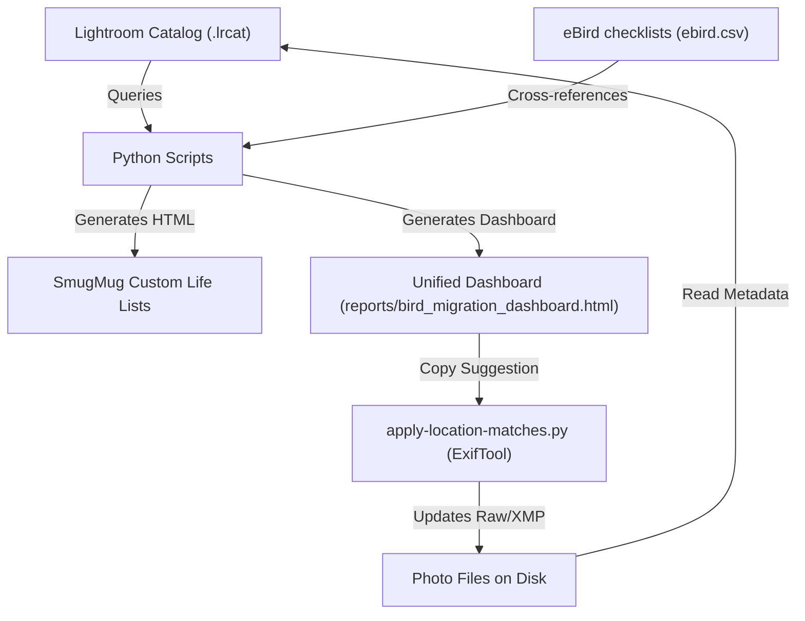

# SmugMug & eBird Metadata Sync Tools

This repository contains a suite of automation tools designed to manage your bird photography library, synchronize metadata between your **Lightroom Classic catalog**, **eBird checklists**, and **SmugMug portfolio**, and generate custom lifelist pages.

---

## 🗂️ Project Architecture & Data Flow



---

## 🐍 Script Catalog

### 1. Location & Publishing Dashboard
* **`migration-and-publishing-dashboard.py`**
  * *Purpose*: The single central command center showing species publication status, missing locations, missing taxonomic tags, and taxonomy migrations.
  * *Features*:
    * *Dynamic Location Suggester*: Displays date-matched eBird checklist hotspots directly inside the species details drawer for location recovery, complete with confidence color-coding (green/yellow) and click-to-copy buttons.
    * *Automated Taxonomy Resolver*: Programmatically traces obsolete species tags and typos to official v2025 names using case-insensitive/spacing normalization and historical scientific name/species code mapping.
    * *Synced Filter Toggle*: A browser-based check box dynamically hides/shows fully migrated species rows to keep focus on remaining cleanups.
    * *Sorting*: Rows are sorted alphabetically by species common name.
    * *Exclusions*: Automatically ignores tags specified in `EXCLUDED_TAGS` (e.g., `"People"`, `"Wildlife"`, `"Pet"`, `"Wedding"`).
  * *Outputs*: Terminal summary report, the master interactive HTML dashboard ([reports/bird_migration_dashboard.html](file:///Users/walker/Dropbox/smugmug-species-list/reports/bird_migration_dashboard.html)), and [reports/bird_migration_dashboard.csv](file:///Users/walker/Dropbox/smugmug-species-list/reports/bird_migration_dashboard.csv).
* **`apply-location-matches.py`**
  * *Purpose*: Automation loop that runs `exiftool` to write location details (sub-location, city, state, country) directly back to your raw image files or `.xmp` sidecars based on matched eBird checklist locations.

### 2. Custom Life List Page Generators
These scripts query your Lightroom database to find your earliest published photos of each species and compile customized SmugMug lifelist indexes:
* **`taxonomic-life-list-custom-page.py`**
  * *Generates*: [html/taxonomic_life_list.html](file:///Users/walker/Dropbox/smugmug-species-list/html/taxonomic_life_list.html) (indexed taxonomically by Order and Family).
* **`alphabetical-lifelist-custom-page.py`**
  * *Generates*: [html/alphabetical_life_list.html](file:///Users/walker/Dropbox/smugmug-species-list/html/alphabetical_life_list.html) (indexed alphabetically by English common name).
* **`chronological-lifelist-custom-page.py`**
  * *Generates*: [html/chronological_life_list.html](file:///Users/walker/Dropbox/smugmug-species-list/html/chronological_life_list.html) (indexed chronologically by date first photographed).

### 3. Annual Taxonomy Migration
* **`ebird-keyword-list-generator.py`**
  * *Purpose*: Parses eBird taxonomy CSVs (`taxonomy/eBird_taxonomy_vYYYY.csv`) to generate a hierarchical Lightroom keyword list tree.
  * *Outputs*: `ebird-vYYYY-keyword-list.txt` (importable into Lightroom).
* **`audit_taxonomy_migration.py`**
  * *Purpose*: Audits your catalog for obsolete taxonomy keywords, mapping them to the latest standard. For split species, it cross-references photo capture dates with your `ebird.csv` checklists to auto-recommend the correct split species. (Exposes core audit functions imported directly by the main Dashboard).
  * *Outputs*: [reports/taxonomy_migration_audit.html](file:///Users/walker/Dropbox/smugmug-species-list/reports/taxonomy_migration_audit.html) & [reports/taxonomy_migration_audit.csv](file:///Users/walker/Dropbox/smugmug-species-list/reports/taxonomy_migration_audit.csv).

### 4. Utilities
* **`lrcat_utils.py`**: Central library containing database connections, catalog copying logic, relative URL formatters, and location string formatting helpers.
* **`get_oauth_tokens.py`**: Handles OAuth 1.0a handshake to fetch SmugMug API access tokens.
* **`update_on_this_date.py`**: Updates the "On This Date" widget on your SmugMug homepage.

---

## 🏁 Operational Workflows

### Workflow A: Daily Location Update & Sync
1. Run `python3 migration-and-publishing-dashboard.py` to compile the library health status.
2. Open [reports/bird_migration_dashboard.html](file:///Users/walker/Dropbox/smugmug-species-list/reports/bird_migration_dashboard.html) in your browser. Expand any species carrying the red **`Missing Loc`** badge to see their files and date-matched eBird hotspot suggestions.
3. Click the **Copy** button next to the desired suggested location to capture it to your clipboard.
4. Run `python3 apply-location-matches.py` to write those copied location matches back to your raw files/sidecars.
5. Inside Lightroom: Select the modified photos and run **Metadata ➔ Read Metadata from Files** to update your catalog.

### Workflow B: Rebuilding Custom Lifelists
1. Ensure your latest library changes are published.
2. Run the compiler chain:
   ```bash
   python3 taxonomic-life-list-custom-page.py
   ```
   ```bash
   python3 alphabetical-lifelist-custom-page.py
   ```
   ```bash
   python3 chronological-lifelist-custom-page.py
   ```
3. Copy the compiled HTML content from the `html/` directory to update your custom SmugMug lifelist pages.

### Workflow C: eBird Taxonomy Update & Dashboard Health Checks
1. Download the new eBird taxonomy CSV and place it in the `taxonomy/` folder.
2. Run the dashboard compiler:
   ```bash
   python3 migration-and-publishing-dashboard.py
   ```
3. Open [reports/bird_migration_dashboard.html](file:///Users/walker/Dropbox/smugmug-species-list/reports/bird_migration_dashboard.html) in your browser. Active taxonomic migrations will automatically float to the very top of the dashboard as a dedicated checklist.
   * *(Note: You can still run `python3 audit_taxonomy_migration.py` if you prefer to generate a standalone checklist).*
4. In Lightroom, manually rename obsolete keywords (e.g. rename `Squirrel Cuckoo` to `Common Squirrel-Cuckoo`) and resolve splits using the report's recommendations.
5. Generate the new keyword tree file using `ebird-keyword-list-generator.py` and import it into Lightroom using **Metadata ➔ Import Keywords...**.
6. Delete the old empty `[eBird taxonomy v2024]` parent folder from Lightroom's Keyword List panel.

---

## ⚙️ Prerequisites & Setup

1. **Python Dependencies**:
   * Standard library modules (`sqlite3`, `csv`, `urllib`).
2. **Environment Variables**:
   Create a `.env` file at the project root:
   ```env
   SMUGMUG_API_KEY=your_developer_key
   SMUGMUG_API_SECRET=your_developer_secret
   OAUTH_TOKEN=your_oauth_token
   OAUTH_TOKEN_SECRET=your_oauth_token_secret
   ```
3. **ExifTool**: Ensure `exiftool` is installed on your system path (required for `apply-location-matches.py`).
