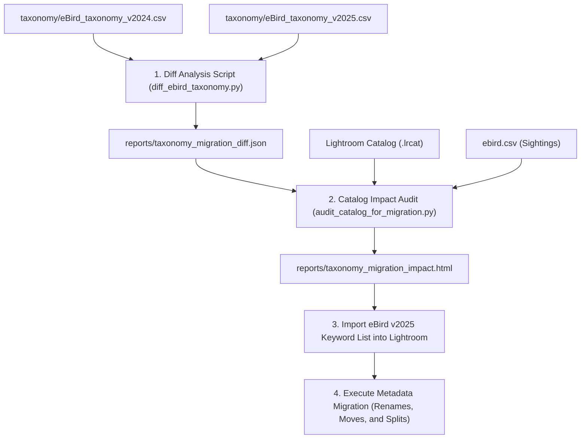

# Annual Lightroom Taxonomy Migration Plan (v2024 ➔ v2025)

Every year, eBird updates its taxonomy—splitting species, merging others, reclassifying families, and renaming common or scientific names. Since your Lightroom keyword hierarchy is based on eBird taxonomy, we need a sustainable, safe, and repeatable workflow to update your catalog and retag affected photos.

This plan details a four-stage process using automated diffing and catalog auditing to make this transition simple and error-free.

---

## 🗺️ Migration Workflow Overview

---

## 🛠️ Step-by-Step Execution Plan

### Stage 1: Automated Taxonomy Diffing
We will write a Python script, `diff_ebird_taxonomy.py`, that compares `taxonomy/eBird_taxonomy_v2024.csv` and `taxonomy/eBird_taxonomy_v2025.csv` by tracking stable species codes. It will categorize changes into:
1. **Renames**: Species keeping their code but changing their common name (e.g. `American Barn Owl` ➔ `Barn Owl`).
2. **Family Transfers**: Species moving to a different family classification (requiring a move in the Lightroom keyword tree).
3. **Splits**: A single 2024 species split into multiple 2025 species (e.g. `Sooty Shearwater` split or similar).
4. **Merges**: Multiple 2024 species combined into one 2025 species.
5. **New Additions**: Brand new species concepts.

This script outputs a machine-readable [reports/taxonomy_migration_diff.json](file:///Users/walker/Dropbox/smugmug-species-list/reports/taxonomy_migration_diff.json).

### Stage 2: Lightroom Impact Audit & Smart Suggestions
We will write a Python script, `audit_catalog_for_migration.py`, that connects to your Lightroom catalog and references the diff JSON. It will scan your tagged photos and generate an interactive **HTML Impact Report** ([reports/taxonomy_migration_impact.html](file:///Users/walker/Dropbox/smugmug-species-list/reports/taxonomy_migration_impact.html)) containing:
* **Renamed Keywords Checklist**: Old keyword names currently in use, and their new names.
* **Family Moves Checklist**: Keywords currently placed under the wrong family parent in your tree.
* **Smart Split Assistance**: 
  * If you have photos tagged with a split species (e.g. `Species A`), it will find those photos.
  * It will cross-reference the photo's **Capture Date** and **Location** with your `ebird.csv` checklists from the same day. 
  * If you logged the split species `Species B` on your checklist that day, it will suggest: *"Tag this photo as Species B (based on eBird checklist at Location X)."*

### Stage 3: Generate and Import the 2025 Keyword Tree
1. Update `ebird-keyword-list-generator.py` to read `taxonomy/eBird_taxonomy_v2025.csv` and generate `ebird-v2025-keyword-list.txt`.
2. Inside Lightroom:
   * Select **Metadata ➔ Import Keywords...**
   * Choose `ebird-v2025-keyword-list.txt`.
   * **Lightroom Merge Behavior**: Lightroom will **merge** the new keywords into your existing list instead of replacing it:
     * *Unchanged Keywords*: Will remain perfectly intact with all photo counts.
     * *New Keywords*: (like the new split species `Western Warbling Vireo` or `Lava Heron`) will be added to the list.
     * *Changed/Old Keywords*: (like the old `Squirrel Cuckoo` or `Whimbrel` before you migrate them) will remain as duplicates with their photo counts.

### Stage 4: Execution Workflow (Renames, Splits, and Tree Purging)
Following this exact order ensures a clean catalog migration:
1. **First, Resolve Renames & Splits (Guided by the HTML Audit Report)**:
   * In Lightroom's Keyword List panel (right sidebar), find and double-click the old keywords under **Section 1** (e.g. `Collared Aracari`, `Elegant Trogon`) and rename them to their new 2025 names (e.g. `Pale-mandibled Aracari`, `Coppery-tailed Trogon`). Lightroom will automatically migrate all your tagged photos to the 2025 standard.
   * For splits under **Section 2** (e.g. `Yellow Warbler`, `Southern Rockhopper Penguin`), locate the specific photos and apply their new confirmed taxonomic keyword tag (e.g. `Northern Yellow Warbler`, `Western Rockhopper Penguin`).
2. **Second, Import the New 2025 Keyword List**:
   * Now import `ebird-v2025-keyword-list.txt` via **Metadata ➔ Import Keywords...**. Since you've already renamed your keywords in Step 1, Lightroom will automatically associate your photos with the correct entries in the new 2025 tree hierarchy.
3. **Third, Purge the Old 2024 Hierarchy**:
   * If you have a top-level parent keyword named `[eBird taxonomy v2024]`, and the new import created `[eBird taxonomy v2025]`, you can safely right-click and **delete** the entire `[eBird taxonomy v2024]` parent folder from your Keyword List panel.
   * *Why is this safe?* Because you migrated all photos to 2025 keywords first, meaning the old 2024 tree folders now contain `0` photos and can be deleted instantly without deleting any tags from your files!

---

## 📈 Sustainability and Annual Reuse
Since the diff and audit scripts are code-driven, doing this in future years (e.g. v2025 ➔ v2026) is simple:
1. Place the new `eBird_taxonomy_v2026.csv` in the `taxonomy/` folder.
2. Update the script parameters to target `v2025` and `v2026`.
3. Run the scripts, follow the HTML report, and import the new keyword tree.

---

> [!NOTE]
> This approach keeps your catalog 100% safe because all keyword renames, tag assignments, and deletions are executed **directly inside Lightroom** (guided by the HTML report), preventing database write corruptions.

> [!TIP]
> Cross-referencing capture dates with eBird sightings will eliminate almost all manual guesswork when resolving species splits.
